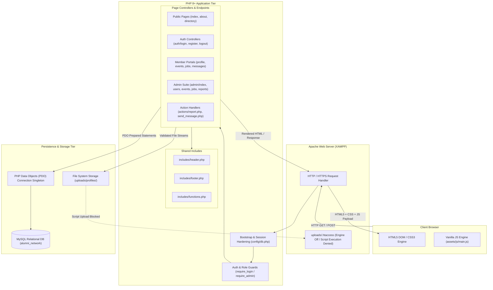
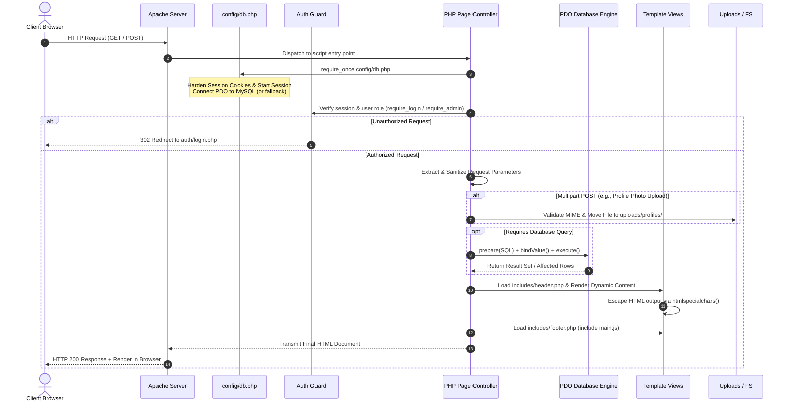
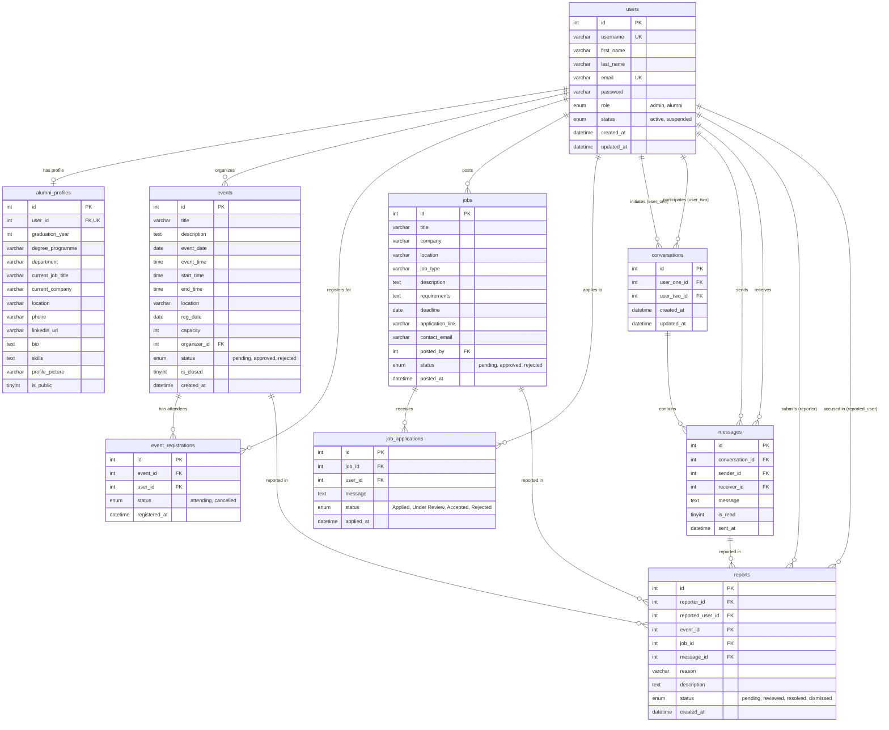

# Architectural System Overview

**Project:** General Sir John Kotelawala Defence University (KDU) Alumni Network  
**Target Environment:** PHP 8+, MySQL / MariaDB (InnoDB), Apache (XAMPP), Vanilla JavaScript, Semantic HTML5, Custom CSS3  
**Document Identifier:** `docs/01-architectural-system-overview.md`  
**Revision:** 1.0.0 (Production Architecture Reference)  

---

## 1. Project Overview

### 1.1 Purpose & Mission
The **KDU Alumni Network** is a dedicated institutional web platform designed for the graduates, current students, faculty members, and administrative staff of General Sir John Kotelawala Defence University. The platform bridges the transition between academic tenure and professional careers by establishing a persistent, secure digital ecosystem for alumni engagement, professional networking, knowledge exchange, mentorship, event participation, and career opportunity dissemination.

### 1.2 Target Audience & Stakeholders
1. **Graduated Alumni:** Seek to maintain lifelong ties with university peers, discover batchmates, share professional milestones, explore vacancies, and propose or attend campus reunions.
2. **Current Students & Graduating Cadets:** Seek mentorship, career opportunities, industry connections, and direct communication with alumni in global corporations.
3. **University Faculty & Administrators:** Require governance tools to moderate user accounts, verify university credentials, publish campus announcements, approve gatherings, review employer vacancies, and uphold institutional integrity.
4. **Alumni Recruiters & Corporate Partners:** University alumni in managerial positions offering internships and employment to junior graduates.

### 1.3 Main Functional Capabilities
* **Identity & Credential Management:** Self-service registration with academic verification fields (batch, degree, department, graduation year), BCRYPT-secured authentication, session lifecycle management, and privacy-preserving profile visibility toggles.
* **Alumni Discovery & Dynamic Directory:** Multi-attribute filtering (graduation cohort, degree programme, department, company, skills) with both server-side pagination (6 items per page) and instant client-side text filtering.
* **Biographical Profiles & Media Uploads:** Comprehensive member portfolios featuring academic credentials, employment history, LinkedIn integration, technical skills tags, and secure multipart image uploading.
* **Campus & Alumni Gatherings (Events Hub):** Interactive event discovery with dynamic RSVP reservation toggles, seat capacity tracking, open/closed lifecycle states, and an alumni proposal mechanism.
* **Career Opportunities & Employment Board:** Job vacancy indexing, job type categorization (Full-Time, Internship, Hybrid, Remote), internal application cover notes, duplicate application guards, and member vacancy posting.
* **Private Direct Communication (1-to-1 Messaging):** Secure peer-to-peer conversations, auto-initializing conversation threads, unread message indicators, and message bubble transcripts with autoscroll.
* **Trust, Safety & Community Moderation:** Contextual reporting of abusive accounts, spam events, fraudulent jobs, or inappropriate messages directly to administrators.
* **Central Administrative Console:** Dashboard metrics, full user lifecycle controls (activate, suspend, change role, cascade delete), and event, job, and report moderation queues.

### 1.4 Technology Stack
The platform intentionally adheres to a native, dependency-free architectural stack suited for university infrastructure:
* **Presentation Tier:** Semantic HTML5, Vanilla JavaScript (ES6+), Responsive CSS3 using the custom **KDU Cinematic Maroon & Gold** palette (`#24070A`, `#120305`, `#4A1116`, `#D4AF37`, `#F1D77A`, `#F3EFE6`, `#FFFFFF`).
* **Application Tier:** PHP 8+ using procedural controllers and modular component includes.
* **Data Access Tier:** PHP Data Objects (PDO) with strict parameterized prepared statements.
* **Persistence Tier:** MySQL 8.0+ / MariaDB 10.4+ relational database with utf8mb4 encoding and foreign key referential integrity.
* **Web Server Tier:** Apache 2.4+ (XAMPP environment) with `.htaccess` runtime security controls.

*Zero external runtime frameworks are used (no React, Angular, Vue, Laravel, CodeIgniter, Bootstrap, Tailwind, jQuery, Node.js, Express, etc.).*

### 1.5 Architectural Paradigm
The system implements a classic **Multi-Page Application (MPA)** architecture structured around lightweight **Page Controllers** and shared component includes. Each user-facing route acts as an autonomous controller that:
1. Boots core configuration, session security, and database connectivity.
2. Performs authentication and role-based authorization guards.
3. Processes incoming HTTP requests (`GET` queries or `POST` actions).
4. Interacts with the persistence layer via PDO.
5. Injects structured view data into a responsive HTML layout framed by shared header and footer components.

---

## 2. System Architecture

### 2.1 Layered Architecture Overview
The platform organizes responsibilities across five distinct tiers:
1. **Client Tier (Browser):** Renders HTML/CSS, handles DOM events, performs immediate client-side input validation, drives mobile navigation toggling, and provides asynchronous search filtering.
2. **Controller & Routing Tier:** PHP route entry points (`index.php`, `directory.php`, `events.php`, `jobs.php`, `profile.php`, `messages.php`, `admin/*.php`) that coordinate incoming HTTP requests and dispatch business logic.
3. **Business Logic & Security Middleware:** Authentication checks (`require_login()`, `require_admin()`), session validation, input sanitization, file MIME inspection, and authorization guards.
4. **Data Access Tier (PDO Layer):** Centralized PDO instance in `config/db.php` providing prepared statement execution, transaction control, and error handling.
5. **Storage & Database Tier:** Relational MySQL schema comprising 9 normalized tables and the server file system (`uploads/profiles/`) protected by Apache execution denial rules.

### 2.2 System Architecture Diagram

---

## 3. Request and Response Lifecycle

Every HTTP request dispatched to the KDU Alumni Network adheres to a strictly defined, predictable lifecycle:

### Detailed Lifecycle Steps
1. **Request Ingestion:** The client browser initiates a request (e.g., `GET /alumni-network/events.php` or `POST /alumni-network/profile.php`). Apache maps the URI to the physical PHP controller.
2. **Session Hardening & Initialization:** `config/db.php` is required before output generation. It sets strict cookie flags (`httponly=true`, `samesite=Lax`, `use_strict_mode=1`, `use_only_cookies=1`) and calls `session_start()`.
3. **Database Bootstrap:** The PDO singleton is created targeting `127.0.0.1:3306` with database `alumni_network`. If the database is missing, `config/db.php` attempts an automatic initialization fallback using `database/schema.sql`.
4. **Access Control & Authorization:** Protected pages invoke `require_login()` or `require_admin()`. Unauthenticated or unauthorized visitors are halted and redirected via HTTP 302 location headers.
5. **Input Extraction & Server-Side Validation:** The controller inspects `$_GET`, `$_POST`, and `$_FILES`. Form inputs are trimmed, sanitized, and validated against domain rules (e.g., email format, graduation year range 1960–2030, file MIME types).
6. **Persistence Operations:** The controller executes queries using prepared statements with bound parameters (`$stmt->execute([$param1, ...])`). Complex multi-table writes (such as user registration or profile updates) are executed within explicit transactions (`beginTransaction()`, `commit()`, `rollBack()`).
7. **State Transitions & Flash Messages:** Flash status messages (`$message`, `$messageType`) are computed to notify the user of successful or failed actions.
8. **View Assembly & Header Rendering:** `includes/header.php` outputs HTML document headers, stylesheets, navigation bars, and unread notification badges.
9. **Defensive Output Escaping:** Dynamic data retrieved from the database or user input is wrapped in `htmlspecialchars($value, ENT_QUOTES, 'UTF-8')` before emitting into the DOM to eliminate Cross-Site Scripting (XSS).
10. **Client Delivery & Progressive Enhancement:** `includes/footer.php` closes the DOM and loads `assets/js/main.js`, which attaches event listeners for mobile navigation, alert dismissals, and client-side instant filtering.

---

## 4. Authentication and Authorization Architecture

### 4.1 Authentication Workflow
* **Registration (`auth/register.php`):** Accepts student/alumnus details (full name, username, email, academic cohort, degree, department, password). Validates uniqueness of email and username. Encrypts password using `password_hash($password, PASSWORD_BCRYPT)`. Atomically creates records across both `users` and `alumni_profiles` tables within a database transaction.
* **Login (`auth/login.php`):** Accepts either email address or username alongside plaintext password. Queries the `users` table via prepared statement. Verifies credentials using `password_verify($password, $user['password'])`. Verifies that `user['status'] !== 'suspended'`.
* **Session Regeneration:** Upon successful authentication, `session_regenerate_id(true)` is immediately invoked to invalidate the previous session ID and eradicate session fixation attack vectors.
* **Session Payload:** The active session stores non-sensitive identity markers: `$_SESSION['user_id']`, `$_SESSION['user_name']`, `$_SESSION['user_role']`, and `$_SESSION['user_email']`.
* **Logout (`auth/logout.php`):** Unsets all session variables (`$_SESSION = []`), deletes the session cookie with past expiration timestamps, and terminates session storage with `session_destroy()`.

### 4.2 Role-Based Access Control (RBAC) Matrix
The platform defines two discrete authorization tiers:

| Route / Capability | Public Guest | Authenticated Alumnus (`role = 'alumni'`) | Administrator (`role = 'admin'`) |
| :--- | :---: | :---: | :---: |
| View Homepage & About (`index.php`, `about.php`) | Allowed | Allowed | Allowed |
| Browse Alumni Directory (`directory.php`) | Allowed (Public Profiles) | Allowed (Public Profiles) | Allowed (All Profiles) |
| View Public Profile Details (`profile.php?id=X`) | Allowed (Public Profiles) | Allowed (Public Profiles) | Allowed (All Profiles) |
| Edit Profile & Upload Avatar (`profile.php`) | Denied (Redirect) | Allowed (Own Account Only) | Allowed (Own Account Only) |
| Browse Approved Events & Jobs (`events.php`, `jobs.php`) | Allowed | Allowed | Allowed |
| RSVP for Event / Cancel RSVP (`events.php`) | Denied (Redirect) | Allowed | Allowed |
| Propose Event / Post Vacancy (`events.php`, `jobs.php`) | Denied (Redirect) | Allowed (Pending Moderation) | Allowed (Pending Moderation) |
| Apply for Job Opportunity (`jobs.php`) | Denied (Redirect) | Allowed | Allowed |
| Private Direct Messaging (`messages.php`) | Denied (Redirect) | Allowed (Own Conversations) | Allowed (Own Conversations) |
| Submit Misconduct Report (`actions/report.php`) | Denied (Redirect) | Allowed | Allowed |
| Admin Console (`admin/index.php`, `admin/users.php`, etc.) | Denied (Redirect) | Denied (Redirect) | Full Control |
| Database Maintenance Tool (`config/setup.php`) | Allowed (First-time only) | Denied (Redirect) | Allowed |

### 4.3 Resource-Level Ownership Authorization
Beyond role checks, individual endpoints enforce resource ownership:
* **Profile Editing:** `profile.php` checks `$isOwner = ($currentUserId && $viewUserId == $currentUserId)`. Non-owners cannot see or submit profile updates.
* **Conversation Participation:** `messages.php` checks that the active user ID matches either `user_one_id` or `user_two_id` before retrieving message transcripts or accepting message submissions.
* **Root Administrator Safety:** `admin/users.php` enforces immutable protection preventing modification or deletion of User ID 1 (Root Admin) and prevents administrators from suspending or deleting their own active session.

---

## 5. Database Architecture

### 5.1 Connection Architecture
The database interface is implemented via PHP's `PDO` driver configured in `config/db.php`:
* **DSN:** `mysql:host=127.0.0.1;dbname=alumni_network;charset=utf8mb4`
* **Error Mode:** `PDO::ATTR_ERRMODE => PDO::ERRMODE_EXCEPTION`
* **Fetch Mode:** `PDO::ATTR_DEFAULT_FETCH_MODE => PDO::FETCH_ASSOC`
* **Emulated Prepares:** `PDO::ATTR_EMULATE_PREPARES => false` (forces native MySQL server-side prepared statements).

### 5.2 Relational Entity-Relationship Diagram

### 5.3 Referential Integrity & Cascade Rules
* `alumni_profiles.user_id` cascades on deletion of `users.id`. Deleting a user wipes their biographical profile automatically.
* `event_registrations` cascade on deletion of either `events.id` or `users.id`.
* `job_applications` cascade on deletion of either `jobs.id` or `users.id`.
* `conversations` cascade on deletion of either participant.
* `messages` cascade on deletion of `conversations.id`.
* Foreign key constraints guarantee that orphaned attendance, conversation, or application records cannot exist in the storage engine.

---

## 6. Main Functional Modules

### 6.1 Authentication & Security Module
* **Purpose:** Handles user registration, credential verification, session lifecycle, and route protection.
* **Key Files:** `auth/register.php`, `auth/login.php`, `auth/logout.php`, `config/db.php`, `includes/auth.php`.
* **Database Tables:** `users`, `alumni_profiles`.
* **Status:** `VERIFIED WORKING`.

### 6.2 Alumni Profiles Module
* **Purpose:** Enables members to view and update biographical data, upload avatar pictures, declare career skills, and configure privacy visibility.
* **Key Files:** `profile.php`, `includes/functions.php`, `uploads/.htaccess`.
* **Database Tables:** `users`, `alumni_profiles`.
* **Status:** `VERIFIED WORKING`.

### 6.3 Alumni Directory Module
* **Purpose:** Search and filter engine enabling alumni discovery by graduation cohort, degree, department, company, and keywords with pagination.
* **Key Files:** `directory.php`, `includes/header.php`, `assets/js/main.js`.
* **Database Tables:** `users`, `alumni_profiles`.
* **Status:** `VERIFIED WORKING`.

### 6.4 Campus & Alumni Events Module
* **Purpose:** Catalogs university gatherings, reunions, and seminars. Manages RSVP seat reservations, capacity enforcement, and alumni event proposals.
* **Key Files:** `events.php`, `event.php`, `admin/events.php`.
* **Database Tables:** `events`, `event_registrations`, `users`.
* **Status:** `VERIFIED WORKING`.

### 6.5 Career Board & Opportunities Module
* **Purpose:** Manages employment vacancies, internships, internal cover-letter applications, duplicate application prevention, and member vacancy posting.
* **Key Files:** `jobs.php`, `job.php`, `admin/jobs.php`.
* **Database Tables:** `jobs`, `job_applications`, `users`.
* **Status:** `VERIFIED WORKING`.

### 6.6 Private Direct Messaging Module
* **Purpose:** Peer-to-peer 1-to-1 conversation engine with auto-initialization, chronological transcripts, unread indicators, and message bubble autoscroll.
* **Key Files:** `messages.php`, `conversation.php`, `send_message.php`, `includes/header.php`.
* **Database Tables:** `conversations`, `messages`, `users`, `alumni_profiles`.
* **Status:** `VERIFIED WORKING`.

### 6.7 Trust, Safety & Community Moderation Module
* **Purpose:** Member reporting tool allowing users to flag abusive profiles, spam events, or fraudulent vacancies to university administrators.
* **Key Files:** `actions/report.php`, `admin/reports.php`.
* **Database Tables:** `reports`, `users`, `events`, `jobs`, `messages`.
* **Status:** `VERIFIED WORKING`.

### 6.8 Administrative Console Module
* **Purpose:** Centralized administrative control center featuring real-time analytical metrics, user lifecycle controls, and moderation workflows for events, jobs, and reports.
* **Key Files:** `admin/index.php`, `admin/users.php`, `admin/events.php`, `admin/jobs.php`, `admin/reports.php`, `admin/settings.php`, `admin/includes/sidebar.php`.
* **Database Tables:** All tables.
* **Status:** `VERIFIED WORKING`.

### 6.9 Shared Frontend & Presentation Components
* **Purpose:** Universal layout framework providing consistent branding, navigation menus, footer links, and responsive styling.
* **Key Files:** `includes/header.php`, `includes/footer.php`, `assets/css/style.css`, `assets/js/main.js`.
* **Status:** `VERIFIED WORKING`.

---

## 7. Security Architecture

### 7.1 Verified Security Controls

| Security Domain | Implementation Mechanism | Verification Status |
| :--- | :--- | :---: |
| **Password Hashing** | Passwords hashed using BCRYPT (`password_hash($pwd, PASSWORD_BCRYPT)`). Checked via constant-time `password_verify()`. Plaintext passwords never stored. | **Verified** |
| **SQL Injection Defense** | 100% of queries use PDO prepared statements with parameter binding. Emulated prepares disabled (`ATTR_EMULATE_PREPARES => false`). | **Verified** |
| **Cross-Site Scripting (XSS)** | Dynamic outputs wrapped in `htmlspecialchars($text, ENT_QUOTES, 'UTF-8')`. Plaintext outputs neutralized. | **Verified** |
| **Session Fixation Defense** | Invocation of `session_regenerate_id(true)` immediately upon credential verification during login. | **Verified** |
| **Session Cookie Hardening** | `HttpOnly` enabled (defeats JavaScript cookie theft), `SameSite=Lax` enabled (mitigates CSRF), `use_only_cookies=1`, and `use_strict_mode=1`. | **Verified** |
| **File Upload Security** | MIME-type verified via `getimagesize()`. Maximum size capped at 2MB. Extension whitelisted (`jpg`, `jpeg`, `png`, `webp`). Cryptographically random filenames generated (`avatar_{uid}_{time}_{hash}.{ext}`). | **Verified** |
| **Upload Directory Hardening** | `.htaccess` deployed in `uploads/` and `uploads/profiles/` disabling the PHP engine (`php_flag engine off`) and denying script execution. | **Verified** |
| **Access Control (RBAC)** | `require_login()` and `require_admin()` guard all restricted routes. Non-admin users are blocked from admin views. | **Verified** |
| **Data Integrity & Safety** | Relational foreign keys enforce cascading deletes. Root Admin (User ID 1) protected from modification or deletion. | **Verified** |

### 7.2 CSRF Handling Disclosure
* In compliance with project guidelines, blocking CSRF token validation errors have been streamlined (`verify_csrf_token()` returns `true`).
* Session cookies enforce `SameSite=Lax`, providing baseline browser-level cross-site request mitigation for modern browsers.

---

## 8. Deployment Architecture

### 8.1 Local Development Environment (XAMPP)
1. **Server Suite:** Apache 2.4+ and MySQL 8.0+ / MariaDB 10.4+ managed via XAMPP Control Panel.
2. **Project Path:** `c:\xampp\htdocs\alumni-network`
3. **Local Entry URL:** `http://localhost/alumni-network/`
4. **Database Configuration:**
   * Host: `127.0.0.1` (Port `3306`)
   * Database Name: `alumni_network`
   * User: `root`
   * Password: `""` (Empty string by default in XAMPP)
5. **Database Initialization:**
   * Navigate to `http://localhost/alumni-network/config/setup.php` or import `database/schema.sql` via phpMyAdmin.
6. **File Permissions:**
   * Ensure `uploads/` and `uploads/profiles/` have write permissions for the web server user.

### 8.2 Deployment Limitations & Recommendations
* The local configuration defaults to development credentials (`root` without password). When deploying to a public production host, database credentials must be updated in `config/db.php`.
* HTTPS must be configured with valid SSL/TLS certificates so that the `$is_https` check in `config/db.php` activates the `secure` session cookie attribute.
