# Directory & Folder Taxonomy

**Project:** General Sir John Kotelawala Defence University (KDU) Alumni Network  
**Target Environment:** PHP 8+, MySQL / MariaDB, Apache (XAMPP), Vanilla JS, Semantic HTML5, CSS3  
**Document Identifier:** `docs/02-directory-and-folder-taxonomy.md`  
**Revision:** 1.0.0 (Repository Structure Reference)  

---

## 1. Complete Project Directory Tree

The following directory tree represents the actual verified files and folders in the KDU Alumni Network repository:

```text
alumni-network/
│
├── .gitignore                                   # Git ignore rules for temporary files and local caches
├── README.md                                    # Root project introduction and quick-start guide
├── about.php                                    # Public institutional overview & university leadership
├── conversation.php                             # Direct route alias to active messaging conversations
├── directory.php                                # Alumni search, multi-filter & paginated directory
├── event.html                                   # Legacy static HTML prototype for event browsing
├── event.js                                     # Legacy client-side JavaScript for event prototype
├── event.php                                    # Single-event router & JSON API adapter
├── eventadmin.html                              # Legacy static HTML prototype for event moderation
├── eventadmin.js                                # Legacy client-side JavaScript for event moderation
├── eventcreate.html                             # Legacy static HTML prototype for proposing events
├── eventcreate.js                               # Legacy client-side JavaScript for event form handling
├── events.php                                   # Campus & alumni events hub (RSVP & proposals)
├── index.php                                    # Public landing homepage & featured showcase
├── job.php                                      # Career router, legacy API adapter & schema migrate
├── jobadmin.html                                # Legacy static HTML prototype for job moderation
├── jobadmin.js                                  # Legacy client-side JavaScript for job moderation
├── jobcreate.html                               # Legacy static HTML prototype for creating job vacancies
├── jobs.html                                    # Legacy static HTML prototype for browsing jobs
├── jobs.js                                      # Legacy client-side JavaScript for jobs prototype
├── jobs.php                                     # Career opportunities board (apply & post jobs)
├── messages.php                                 # 1-to-1 private messaging & conversation viewer
├── profile.php                                  # Alumni profile view, multi-field editor & photo upload
├── schema.sql                                   # Root convenience copy of relational database schema
├── send_message.php                             # Direct POST action bridge for sending private messages
│
├── actions/                                     # Non-rendering background POST action controllers
│   └── report.php                               # Submits content/user misconduct reports
│
├── admin/                                       # Administrative management console
│   ├── index.php                                # Admin dashboard, analytical metrics & queues
│   ├── events.php                               # Event moderation (approve, reject, delete)
│   ├── jobs.php                                 # Job vacancy moderation (approve, reject, delete)
│   ├── reports.php                              # Trust & safety report resolution & user suspension
│   ├── settings.php                             # Platform environment diagnostics & re-seed link
│   ├── users.php                                # Member lifecycle management (activate, suspend, delete)
│   └── includes/                                # Reusable administrative UI sub-components
│       └── sidebar.php                          # Navigation sidebar with pending report counters
│
├── assets/                                      # Static client-side frontend resources
│   ├── css/                                     # Custom CSS3 stylesheets
│   │   ├── event.css                            # Specialized styles for events components
│   │   ├── jobs.css                             # Specialized styles for career board components
│   │   └── style.css                            # Master stylesheet (KDU Maroon & Gold palette)
│   ├── images/                                  # Vector graphic illustrations & avatars
│   │   ├── campus-hero.svg                      # KDU campus auditorium vector illustration
│   │   ├── default-avatar.svg                   # Default alumni silhouette avatar
│   │   └── event-placeholder.svg                # Event banner vector placeholder
│   └── js/                                      # Client-side progressive enhancement scripts
│       └── main.js                              # Mobile menu toggle, alert dismiss, live filtering
│
├── auth/                                        # Authentication & session controllers
│   ├── login.php                                # User authentication & session generation
│   ├── logout.php                               # Session destruction & cookie invalidation
│   └── register.php                             # Self-service member onboarding & profile provisioning
│
├── config/                                      # System configuration & persistence bootstrap
│   ├── db.php                                   # Session hardening, PDO singleton & mock fallbacks
│   └── setup.php                                # Database initialization & schema re-seeder tool
│
├── database/                                    # Canonical SQL schema & migrations
│   └── schema.sql                               # Normalized 9-table schema definition with seed records
│
├── docs/                                        # Comprehensive technical documentation package
│   ├── README.md                                # Documentation package index and reading guide
│   ├── 01-architectural-system-overview.md      # Architecture, request lifecycle, ER diagram & security
│   ├── 02-directory-and-folder-taxonomy.md      # Directory tree, folder responsibilities & dependencies
│   ├── 03-complete-file-by-file-technical-description.md # Comprehensive 16-point file-by-file specification
│   ├── 04-four-phase-project-roadmap.md         # Four-phase roadmap, milestones & task matrix
│   └── 05-testing-and-acceptance-guide.md       # Step-by-step test cases & verification procedure
│
└── uploads/                                     # User-uploaded files storage
    ├── .htaccess                                # Apache security controls (engine off / deny script execution)
    └── profiles/                                # Uploaded alumni avatar images
        └── .htaccess                            # Subdirectory script execution denial
```

---

## 2. Folder-by-Folder Technical Explanation

### 2.1 Root Web Root (`/`)
* **Purpose:** Serves as the primary public entry point for web visitors and houses core page controllers, route aliases, and legacy prototypes.
* **Contents:** Public pages (`index.php`, `about.php`), directory views (`directory.php`), portal pages (`events.php`, `jobs.php`, `profile.php`, `messages.php`), routing bridges (`event.php`, `job.php`, `conversation.php`, `send_message.php`), and prototype artifacts (`*.html`, `*.js`).
* **Application Layer:** Presentation and Controller Tier.
* **Dependencies:** Relies on `config/db.php`, `includes/header.php`, `includes/footer.php`, and `includes/functions.php`.
* **Security Considerations:** Enforces session-based authentication checks (`require_login()`) on member-only views (`profile.php`, `messages.php`). Public views escape all database-retrieved strings via `htmlspecialchars()`.
* **Current Status:** `VERIFIED WORKING`.

### 2.2 Actions Directory (`actions/`)
* **Purpose:** Houses background HTTP POST controllers that execute state changes without rendering full HTML pages, immediately redirecting users upon completion.
* **Contents:** `report.php`.
* **Application Layer:** Business Logic & Action Controller Tier.
* **Dependencies:** Depends on `config/db.php` for database access and session guards.
* **Security Considerations:** Restricted strictly to authenticated members via `require_login()`. Rejects non-POST requests by redirecting to homepage. Uses PDO prepared statements for database insertion.
* **Current Status:** `VERIFIED WORKING`.

### 2.3 Administration Directory (`admin/`)
* **Purpose:** Provides a protected management suite for university administrators to monitor site metrics, manage user accounts, moderate community proposals, and handle reports.
* **Contents:** Dashboard (`index.php`), user management (`users.php`), event moderation (`events.php`), job moderation (`jobs.php`), trust & safety reports (`reports.php`), system settings (`settings.php`), and `admin/includes/sidebar.php`.
* **Application Layer:** Administrative Presentation & Control Tier.
* **Dependencies:** Depends on `config/db.php` and `includes/functions.php`.
* **Security Considerations:** Every file enforces `require_admin()` at the top of execution, redirecting unauthorized users. Root administrator (ID 1) is protected from deletion or status modification.
* **Current Status:** `VERIFIED WORKING`.

### 2.4 Administrative Includes Directory (`admin/includes/`)
* **Purpose:** Contains shared template sub-components specific to the administrative dashboard layout.
* **Contents:** `sidebar.php`.
* **Application Layer:** Presentation Sub-Component.
* **Dependencies:** Included by all files under `admin/`. Uses `get_pending_reports_count()` from `config/db.php`.
* **Security Considerations:** Rendered only within already-authenticated admin controllers.
* **Current Status:** `VERIFIED WORKING`.

### 2.5 Assets Directory (`assets/`)
* **Purpose:** Central repository for static client-side resources: stylesheets, SVG graphics, and JavaScript files.
* **Contents:** Subdirectories `assets/css/`, `assets/images/`, and `assets/js/`.
* **Application Layer:** Static Frontend Asset Tier.
* **Dependencies:** Consumed by client web browsers via `<link>` and `<script>` tags in `includes/header.php` and `includes/footer.php`.
* **Security Considerations:** Static files only; no executable server code. MIME types properly handled by web server.
* **Current Status:** `VERIFIED WORKING`.

### 2.6 Authentication Directory (`auth/`)
* **Purpose:** Implements user authentication workflows: login credential verification, new member registration, and session termination.
* **Contents:** `login.php`, `register.php`, `logout.php`.
* **Application Layer:** Authentication & Session Management Tier.
* **Dependencies:** Depends on `config/db.php` for password verification, session hardening, and user provisioning.
* **Security Considerations:** Passwords hashed with BCRYPT. Credentials verified using constant-time comparison in `password_verify()`. Session ID regenerated via `session_regenerate_id(true)` upon successful login.
* **Current Status:** `VERIFIED WORKING`.

### 2.7 Configuration Directory (`config/`)
* **Purpose:** Houses core configuration files, session security rules, database connection logic, and the database setup tool.
* **Contents:** `db.php`, `setup.php`.
* **Application Layer:** Infrastructure & Persistence Bootstrap Tier.
* **Dependencies:** `db.php` is included by every PHP controller in the application.
* **Security Considerations:** Configures secure cookie parameters (`httponly`, `samesite=Lax`, `use_only_cookies=1`). Database setup endpoint (`setup.php`) is protected against unauthorized resets when the database contains active users.
* **Current Status:** `VERIFIED WORKING`.

### 2.8 Database Directory (`database/`)
* **Purpose:** Contains the canonical relational database schema and initial seed data.
* **Contents:** `schema.sql`.
* **Application Layer:** Persistence Layer Definition.
* **Dependencies:** Read by `config/setup.php` and `config/db.php` during automated database initialization.
* **Security Considerations:** Schema file does not store live production secrets. Default seed passwords use pre-computed BCRYPT hashes.
* **Current Status:** `VERIFIED WORKING`.

### 2.9 Shared Includes Directory (`includes/`)
* **Purpose:** Provides reusable UI templates, global layout wrappers, helper functions, and authentication loaders.
* **Contents:** `header.php`, `footer.php`, `functions.php`, `auth.php`.
* **Application Layer:** Shared Presentation & Utility Tier.
* **Dependencies:** Included by page controllers across the site.
* **Security Considerations:** `header.php` requires `config/db.php` first, ensuring session parameters are set before output. `functions.php` provides centralized XSS escaping via `sanitize_output()`.
* **Current Status:** `VERIFIED WORKING`.

### 2.10 Technical Documentation Directory (`docs/`)
* **Purpose:** Contains the comprehensive technical documentation suite, architecture specifications, file inventories, roadmaps, and manual testing guides.
* **Contents:** `README.md`, `01-architectural-system-overview.md`, `02-directory-and-folder-taxonomy.md`, `03-complete-file-by-file-technical-description.md`, `04-four-phase-project-roadmap.md`, `05-testing-and-acceptance-guide.md`.
* **Application Layer:** Engineering & Governance Documentation Tier.
* **Current Status:** `VERIFIED WORKING`.

### 2.11 Uploads Storage Directory (`uploads/` & `uploads/profiles/`)
* **Purpose:** Stores user-uploaded media files, specifically alumni profile avatar pictures.
* **Contents:** Uploaded images (`avatar_*.png`, `avatar_*.jpg`, `avatar_*.webp`) and security configuration files (`.htaccess`).
* **Application Layer:** Persistence & File Storage Tier.
* **Dependencies:** Populated by file upload handlers in `profile.php`.
* **Security Considerations:** Protected by `.htaccess` rules that disable the PHP engine (`php_flag engine off`), strip PHP handlers, and deny script execution to prevent Remote Code Execution (RCE) attacks.
* **Current Status:** `VERIFIED WORKING`.

---

## 3. Application Layers & Architecture Separation

The platform organizes functionality across distinct conceptual layers:

```
┌─────────────────────────────────────────────────────────────┐
│                    Presentation Layer                       │
│  includes/header.php, includes/footer.php, assets/css/      │
├─────────────────────────────────────────────────────────────┤
│                    Page Controller Tier                     │
│  index.php, directory.php, events.php, jobs.php, profile.php│
├─────────────────────────────────────────────────────────────┤
│             Business Logic & Authorization Guards           │
│  require_login(), require_admin(), ownership checks         │
├─────────────────────────────────────────────────────────────┤
│                Action Controllers (Endpoints)               │
│  actions/report.php, send_message.php, event.php, job.php   │
├─────────────────────────────────────────────────────────────┤
│                    Data Access Tier (PDO)                   │
│  config/db.php ($pdo prepared statements & transactions)    │
├─────────────────────────────────────────────────────────────┤
│                    Storage & Persistence                    │
│  MySQL Database (alumni_network) & uploads/profiles/        │
└─────────────────────────────────────────────────────────────┘
```

### Layer Analysis & Architectural Observations
1. **Controller and View Co-location:** In the current implementation, page controllers (e.g., `events.php`, `jobs.php`) handle both request processing (evaluating `POST` actions) and view rendering (outputting HTML). While typical of procedural PHP applications, separating complex POST actions into dedicated action handlers (similar to `actions/report.php`) represents a clean architectural enhancement for future iterations.
2. **Centralized Infrastructure:** Database connectivity, session security, and role-checking helpers are cleanly centralized in `config/db.php`, preventing duplicate connection logic across pages.
3. **Defense-in-Depth File Storage:** Uploaded files are segregated into `uploads/profiles/` and shielded by web-server-level execution denial rules, decoupling user media from executable code.

---

## 4. File Naming and Organization Conventions

* **Root Page Controllers:** Named intuitively after their domain entity (`index.php`, `about.php`, `directory.php`, `events.php`, `jobs.php`, `profile.php`, `messages.php`).
* **Authentication Pages:** Grouped under `auth/` using standard lifecycle names (`login.php`, `register.php`, `logout.php`).
* **Administrative Pages:** Grouped under `admin/` using entity-based naming (`users.php`, `events.php`, `jobs.php`, `reports.php`, `settings.php`).
* **Background Action Handlers:** Located under `actions/` (`report.php`) or root (`send_message.php`).
* **Shared Components:** Placed in `includes/` (`header.php`, `footer.php`, `functions.php`, `auth.php`).
* **Static Assets:** Organized by asset type under `assets/css/`, `assets/images/`, and `assets/js/`.
* **Legacy Prototype Files:** The repository contains early prototype files (`event.html`, `event.js`, `eventadmin.html`, `eventadmin.js`, `eventcreate.html`, `eventcreate.js`, `jobs.html`, `jobs.js`, `jobadmin.html`, `jobadmin.js`, `jobcreate.html`). These have been superseded by the integrated PHP controllers (`events.php`, `jobs.php`, `admin/events.php`, `admin/jobs.php`), but remain in the codebase for reference and prototype compatibility.

---

## 5. Dependency and Navigation Map

The following Mermaid diagram shows how major files and directories communicate:

```mermaid
flowchart TD
    subgraph CoreConfig["Configuration & Database"]
        DB["config/db.php"]
        Setup["config/setup.php"]
        Schema["database/schema.sql"]
    end

    subgraph CommonIncludes["Shared Includes"]
        Header["includes/header.php"]
        Footer["includes/footer.php"]
        Funcs["includes/functions.php"]
    end

    subgraph AuthModule["Authentication"]
        Login["auth/login.php"]
        Register["auth/register.php"]
        Logout["auth/logout.php"]
    end

    subgraph UserPages["Member & Public Pages"]
        Home["index.php"]
        About["about.php"]
        Directory["directory.php"]
        Profile["profile.php"]
        Events["events.php"]
        Jobs["jobs.php"]
        Messages["messages.php"]
    end

    subgraph AdminModule["Admin Suite"]
        AdminDash["admin/index.php"]
        AdminUsers["admin/users.php"]
        AdminEvents["admin/events.php"]
        AdminJobs["admin/jobs.php"]
        AdminReports["admin/reports.php"]
        AdminSettings["admin/settings.php"]
        AdminSidebar["admin/includes/sidebar.php"]
    end

    subgraph ActionHandlers["Action Handlers"]
        ReportAct["actions/report.php"]
        SendMsg["send_message.php"]
        EventBridge["event.php"]
        JobBridge["job.php"]
    end

    DB --> Header
    DB --> Setup
    Schema --> Setup
    DB --> Funcs
    DB --> Login
    DB --> Register
    DB --> ReportAct
    DB --> SendMsg
    DB --> EventBridge
    DB --> JobBridge

    Header --> Home
    Header --> About
    Header --> Directory
    Header --> Profile
    Header --> Events
    Header --> Jobs
    Header --> Messages

    Footer --> Home
    Footer --> About
    Footer --> Directory
    Footer --> Profile
    Footer --> Events
    Footer --> Jobs
    Footer --> Messages

    Funcs --> Directory
    Funcs --> Profile
    Funcs --> Messages
    Funcs --> AdminUsers

    DB --> AdminDash
    DB --> AdminUsers
    DB --> AdminEvents
    DB --> AdminJobs
    DB --> AdminReports
    DB --> AdminSettings

    AdminSidebar --> AdminDash
    AdminSidebar --> AdminUsers
    AdminSidebar --> AdminEvents
    AdminSidebar --> AdminJobs
    AdminSidebar --> AdminReports
    AdminSidebar --> AdminSettings
```


